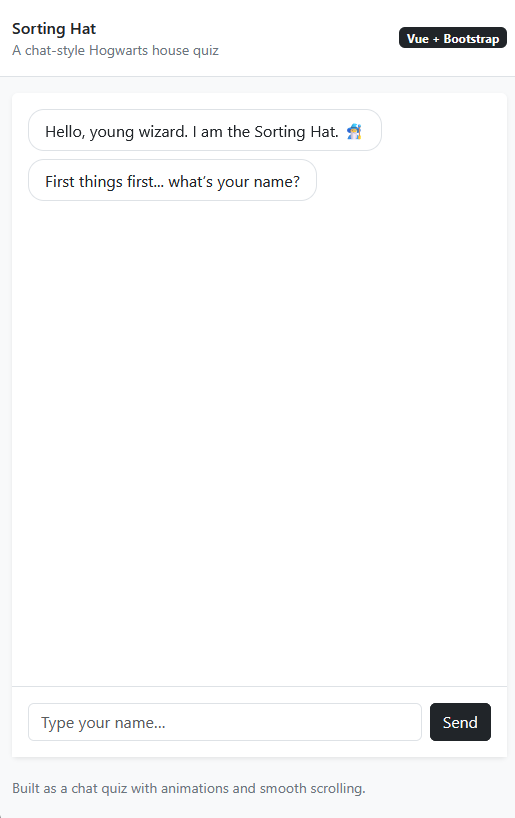
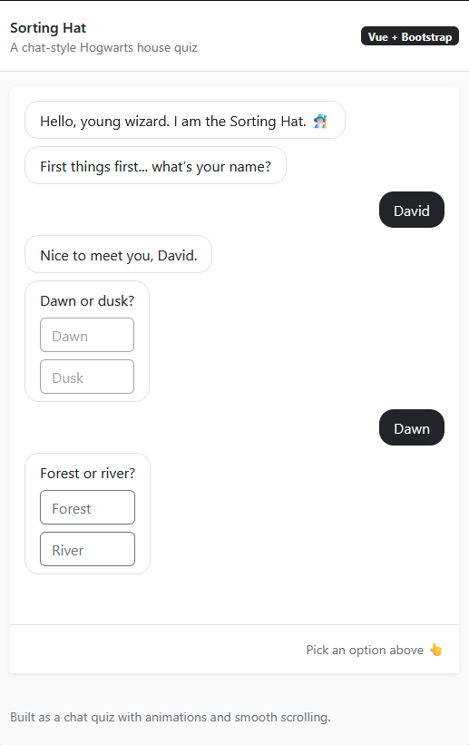
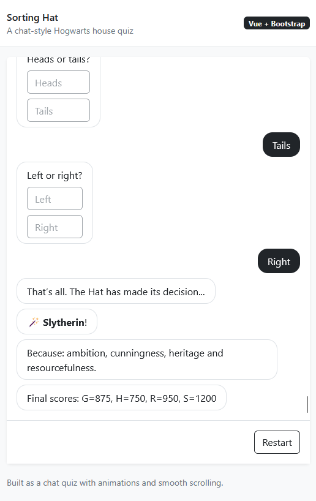

# 🧙‍♂️ Sorting Hat -- Chat Quiz (Vue + Vite + Bootstrap 5)

A chat-style interactive quiz that assigns users to their Hogwarts house
based on weighted answers.

Built with:

-   Vue 3 (Composition API)
-   Vite
-   Bootstrap 5
-   JSON-driven question system
-   Animated chat interface
-   Deterministic scoring engine

## 📸 Screenshots

<p align="center">
  
  
  
</p>
------------------------------------------------------------------------

## ✨ Features

-   Conversational chat UI
-   User name onboarding
-   Fully JSON-driven quiz
-   Weighted scoring per answer
-   Deterministic house selection
-   Smooth scroll to new messages
-   Subtle entry animations
-   Responsive layout (320px → 3000px)
-   Clean component separation
-   Restart support

------------------------------------------------------------------------

## 🏗️ Project Structure

    src/
     ├── assets/
     │    ├── questions.json
     │    └── main.css
     ├── components/
     │    ├── ChatSortingHat.vue
     │    ├── ChatMessage.vue
     │    └── AnswerChoices.vue
     ├── logic/
     │    └── sortingHatEngine.js
     ├── App.vue
     └── main.js

### Responsibilities

**ChatSortingHat.vue** - State machine controller - Handles quiz
progression - Manages scoring - Controls chat message flow

**ChatMessage.vue** - Message rendering (bot/user) - Handles styling and
formatting

**AnswerChoices.vue** - Renders MCQ answers - Emits selected answer

**sortingHatEngine.js** - Score initialization - Score aggregation -
House selection logic - House metadata

------------------------------------------------------------------------

## 🧠 Application Flow

1.  Bot greets user
2.  User provides name
3.  Each question from `questions.json` is asked sequentially
4.  Each selected answer updates cumulative house scores
5.  After all questions:
    -   Highest score determines house
    -   Tie-breaking is deterministic
6.  Result and explanation displayed
7.  User may restart

------------------------------------------------------------------------

## ⚙️ Setup & Installation

### 1. Install dependencies

``` bash
npm install
```

### 2. Run development server

``` bash
npm run dev
```

### 3. Build for production

``` bash
npm run build
```

### 4. Preview production build

``` bash
npm run preview
```

------------------------------------------------------------------------

## 📊 Scoring System

Each answer contains a score object:

``` json
{
  "title": "Answer text",
  "scores": {
    "G": 25,
    "R": 0,
    "H": 50,
    "S": 0
  }
}
```

Scores are accumulated across all questions.

Final house = house with highest score.

Tie-breaking priority:

    G > R > H > S

This ensures deterministic output.

------------------------------------------------------------------------

## 🎨 UI Design Decisions

-   Chat-style layout for conversational feel
-   Bot messages left-aligned
-   User messages right-aligned
-   Bootstrap for layout stability
-   TransitionGroup for smooth entry animations
-   Auto-scroll only on new messages
-   Max-width message bubbles for readability
-   Responsive container scaling

------------------------------------------------------------------------

## 📱 Responsiveness

Designed to work between:

-   320px (mobile)
-   Large desktop and ultrawide screens

Chat viewport uses:

``` css
height: min(72vh, 760px);
```

Ensuring controlled scrolling area across devices.

------------------------------------------------------------------------

## 🔄 Restart Logic

Restart resets:

-   Messages
-   Name
-   Question index
-   Scores
-   Result state

This guarantees a clean replay experience.

------------------------------------------------------------------------

## 🧩 Design Patterns Used

-   Stateless presentation components
-   Centralized scoring engine
-   Unidirectional data flow
-   Event-based answer emission
-   Controlled state machine (ASK_NAME → QUIZ → RESULT)

------------------------------------------------------------------------

## 🚀 Possible Improvements

-   Add typing animation for bot
-   Persist results in localStorage
-   Add house-themed color palette
-   Add sound effects
-   Add unit tests for scoring engine
-   Add E2E test for full quiz flow
-   Randomize question order (optional)
-   Add animated house reveal screen

------------------------------------------------------------------------

## 📌 Technical Notes

-   No external state management library required
-   No backend required
-   Fully client-side
-   JSON-driven configuration allows easy quiz updates

